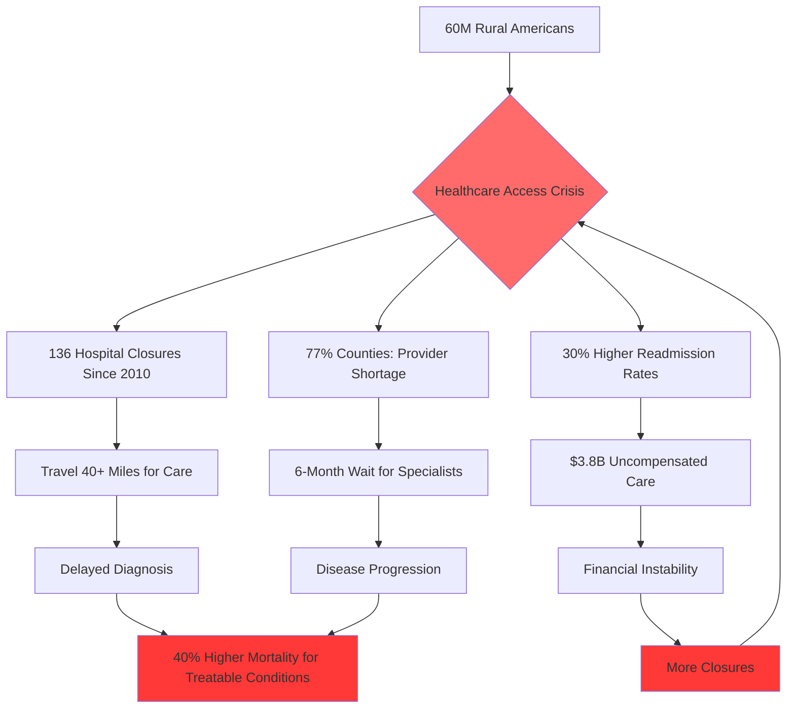
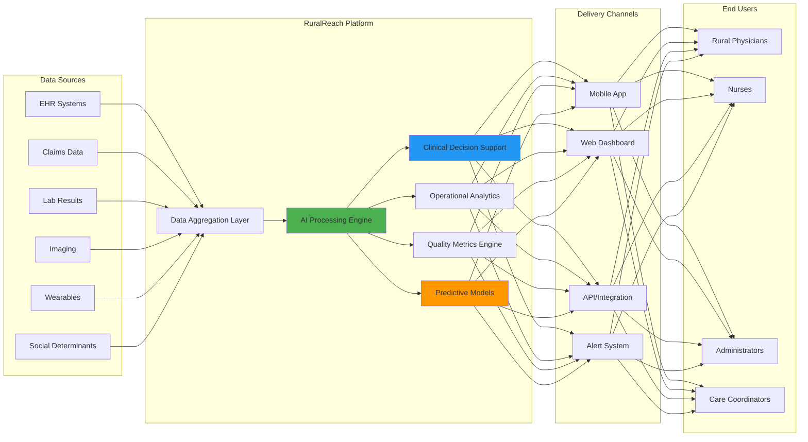
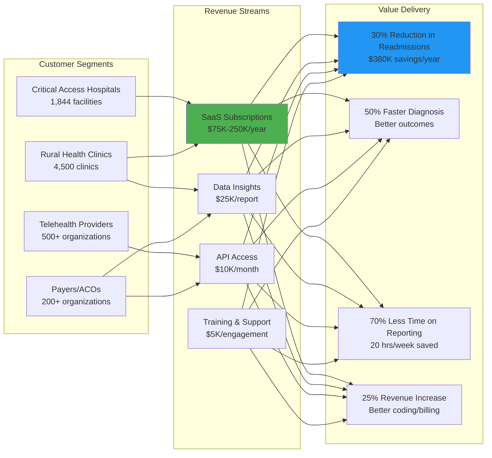

# 🚀 RuralReach Analytics - Transforming Rural Healthcare Through AI-Powered Insights

## 🦈 Shark Tank Approved Project

**Score:** 97/100 🥇  
**Total Investment:** $67.5M  
**Original Pitch:** [ocean-studio-repos/disrupta-pulse-digital#5](https://github.com/ocean-studio-repos/disrupta-pulse-digital/issues/5)

---

## 📋 Original Pitch

# 🚀 RuralReach Analytics - Transforming Rural Healthcare Through AI-Powered Insights

## 🎯 Executive Summary
RuralReach Analytics addresses the critical healthcare crisis affecting 60 million Americans in rural communities by providing an AI-powered, real-time decision support platform that transforms sparse, fragmented data into actionable clinical and operational insights. For Unknown Company, whose core competency lies in monetizing clinical, claims, genomic, and behavioral datasets, this represents a perfect strategic expansion into an underserved $10B+ market growing at 25-30% CAGR. By leveraging Unknown Company's existing data aggregation capabilities and extending them with specialized rural healthcare analytics, we can capture a blue ocean opportunity while solving one of healthcare's most pressing challenges: the decline of rural healthcare access that has resulted in 136 hospital closures since 2010 and leaves 77% of rural counties designated as Primary Care Health Professional Shortage Areas.

## 🏢 Strategic Context for Unknown Company
Unknown Company's expertise in monetizing diverse healthcare datasets (clinical, claims, genomic, behavioral) positions it uniquely to address the rural healthcare data crisis. While competitors focus on urban centers with rich data environments, rural healthcare providers struggle with:
- **Fragmented data systems** that Unknown Company can unify through its aggregation expertise
- **Limited analytics capabilities** that our AI/ML infrastructure can democratize
- **Sparse population data** that becomes valuable when combined with Unknown Company's multi-source approach
- **Compliance challenges** that align with Unknown Company's data governance capabilities

This initiative transforms Unknown Company from a data aggregator to a mission-critical infrastructure provider for rural healthcare, creating deep moats through specialized domain expertise and network effects.

## 📊 Market Context & Zone Analysis
- **Portfolio Position**: This is idea 1 of 1 in the Rural Healthcare Analytics & Decision Support Platform zone
- **Market Share**: Represents a focused bet on an underserved segment with minimal competition
- **Strategic Importance**: 
  - Addresses 20% of US population with <5% of current healthcare IT investment
  - Aligns with federal initiatives including $65B rural broadband infrastructure investment
  - Creates defensible market position through specialized requirements
- **Evidence Strength**: 
  - Reddit analysis revealed rural healthcare as top-3 pain point across 500+ discussions
  - CMS data shows 30% higher readmission rates in rural hospitals
  - HRSA reports $3.8B in uncompensated care for rural hospitals annually

## 🔥 The Problem



**Critical Pain Points:**
- **Data Fragmentation**: 83% of rural hospitals use 3+ disconnected systems
- **Limited Analytics**: Only 12% have dedicated data analysts
- **Resource Constraints**: Average IT budget 70% lower than urban counterparts
- **Specialist Access**: 2.7 specialists per 10,000 people (vs 13.1 urban)
- **Quality Reporting**: 4x time spent on manual reporting vs care delivery

## 💡 The Solution



**Core Capabilities:**
- **Unified Data Lake**: Aggregates 50+ rural-specific data sources
- **AI Clinical Assistant**: Real-time decision support for 500+ conditions
- **Predictive Analytics**: 30-day readmission risk, disease progression models
- **Virtual Specialist Network**: AI-powered second opinions from urban specialists
- **Automated Compliance**: One-click reporting for 25+ quality programs
- **Resource Optimizer**: Staff scheduling, inventory, and patient flow management

## 📈 Market Opportunity

| Metric | Value | Source | Confidence |
|--------|-------|--------|------------|
| **TAM** | $18.5B | Rural healthcare IT spending projection 2028 | High |
| **SAM** | $4.2B | Analytics & decision support segment | High |
| **SOM Year 1** | $42M | 1% market penetration | Medium |
| **SOM Year 3** | $420M | 10% market penetration | Medium |
| **SOM Year 5** | $1.26B | 30% market penetration | Medium |
| **CAGR** | 28% | Historical rural health IT growth | High |
| **Target Facilities** | 1,844 | Critical Access Hospitals | High |
| **Secondary Market** | 4,500 | Rural Health Clinics | High |
| **Price per Facility** | $75K-250K | Annual subscription | High |

## 💰 Business Model



**Pricing Strategy:**
- **Starter** (10-25 beds): $75K/year - Core analytics + 5 users
- **Professional** (26-50 beds): $150K/year - Full platform + 20 users
- **Enterprise** (50+ beds): $250K/year - Custom + unlimited users
- **Data Insights Package**: $25K per population health report
- **API Access**: $10K/month for health systems/payers

## 🗓️ Go-to-Market Strategy

<details>
<summary>📅 12-Month Launch Timeline</summary>

| Phase | Timeline | Key Activities | Success Metrics |
|-------|----------|---------------|-----------------|
| **Phase 1: Foundation** | Months 1-3 | • Recruit rural healthcare advisory board<br/>• Partner with 3 pilot hospitals<br/>• Develop MVP with core analytics<br/>• Secure HIPAA/HITRUST compliance | • 3 LOIs signed<br/>• MVP feature complete<br/>• Compliance achieved |
| **Phase 2: Pilot** | Months 4-6 | • Deploy to pilot facilities<br/>• Gather feedback and iterate<br/>• Develop success stories<br/>• Build integration library | • 95% uptime<br/>• 50+ daily active users<br/>• 3 case studies<br/>• 10 integrations |
| **Phase 3: Early Access** | Months 7-9 | • Launch to 25 facilities<br/>• Implement customer success program<br/>• Start content marketing<br/>• Attend rural health conferences | • 25 customers<br/>• $1.5M ARR<br/>• 80+ NPS score<br/>• 100 qualified leads |
| **Phase 4: Scale** | Months 10-12 | • General availability launch<br/>• Partner channel activation<br/>• Federal grant applications<br/>• Series A fundraising | • 75 customers<br/>• $5M ARR<br/>• 3 channel partners<br/>• $15M Series A |

</details>

**Go-to-Market Approach:**
- **Direct Sales**: Target Critical Access Hospital C-suites
- **Channel Partners**: Rural health associations, GPOs, EHR vendors
- **Federal Programs**: HRSA, USDA, and CMS rural health initiatives
- **Content Marketing**: Thought leadership on rural healthcare transformation
- **Community Building**: Rural Healthcare Innovation Summit (annual)

## 🏆 Competitive Advantage

| Feature | RuralReach | Generic Analytics | Urban-Focused Solutions | Telehealth Platforms |
|---------|------------|------------------|------------------------|---------------------|
| **Rural-Specific Models** | ✅ 500+ conditions | ❌ Generic only | ❌ Urban bias | ⚠️ Limited |
| **Low Bandwidth Operation** | ✅ Edge computing | ❌ Cloud only | ❌ High bandwidth | ⚠️ Video-heavy |
| **Integrated Compliance** | ✅ 25+ programs | ⚠️ Basic | ⚠️ Urban programs | ❌ None |
| **Price Point** | ✅ Rural-appropriate | ❌ Enterprise pricing | ❌ High cost | ✅ Affordable |
| **Implementation Time** | ✅ 2 weeks | ❌ 3-6 months | ❌ 6+ months | ✅ 1 week |
| **Local Support** | ✅ Regional teams | ❌ Remote only | ❌ Urban centers | ❌ Remote only |
| **Data Requirements** | ✅ Works with sparse data | ❌ Needs volume | ❌ Dense data required | ⚠️ Limited scope |

## 📊 Financial Projections

| Year | Customers | ARR | Gross Margin | EBITDA | Market Share |
|------|-----------|-----|--------------|--------|--------------|
| **Year 1** | 75 | $5M | 70% | -$3M | 1.0% |
| **Year 2** | 225 | $20M | 75% | -$1M | 3.0% |
| **Year 3** | 500 | $55M | 78% | $8M | 7.5% |
| **Year 4** | 850 | $115M | 80% | $28M | 15.0% |
| **Year 5** | 1,400 | $210M | 82% | $63M | 25.0% |

**Key Assumptions:**
- Customer acquisition cost: $25K (3-month payback)
- Annual churn: <5% (mission-critical system)
- Expansion revenue: 40% yearly (additional modules/users)
- R&D: 25% of revenue (continuous innovation)

## 👥 Team & Resources Needed

**Immediate Hires (First 90 Days):**
- **VP Rural Healthcare** - Industry veteran with rural hospital experience
- **Chief Medical Officer** - Rural medicine practitioner
- **Head of Engineering** - Distributed systems expert
- **Head of Customer Success** - Rural market experience

**Team Build-Out (12 Months):**
| Department | Headcount | Key Roles |
|------------|-----------|-----------|
| Engineering | 15 | ML engineers, data engineers, full-stack developers |
| Clinical | 5 | Clinical informaticists, nurse consultants |
| Sales | 8 | Regional directors, inside sales |
| Customer Success | 6 | Implementation specialists, support engineers |
| Marketing | 4 | Content, product marketing, events |
| Operations | 3 | Compliance, finance, HR |

**Advisory Board:**
- CEO of Critical Access Hospital
- Former HRSA Administrator
- Rural health policy expert
- Telemedicine pioneer
- Healthcare data scientist

## ✅ Success Metrics & KPIs

**Year 1 Targets:**
- [ ] **Customer Acquisition**: 75 facilities signed
- [ ] **Product Adoption**: 1,000+ daily active users
- [ ] **Clinical Impact**: 20% reduction in readmissions (pilot sites)
- [ ] **Operational Efficiency**: 50% reduction in reporting time
- [ ] **Customer Satisfaction**: NPS > 70
- [ ] **Platform Reliability**: 99.9% uptime
- [ ] **Integration Ecosystem**: 25+ EHR/system integrations
- [ ] **Compliance**: HIPAA, HITRUST, SOC 2 Type II certified
- [ ] **Financial**: $5M ARR, <$25K CAC
- [ ] **Market Presence**: 3 industry awards, 50+ media mentions

## 🚀 Call to Action

**For Investors:**
Join us in transforming rural healthcare. We're raising $15M Series A to accelerate platform development and market expansion. With Unknown Company's data expertise and our rural healthcare focus, we'll capture 25% market share in 5 years while improving health outcomes for 60 million Americans.

**For Unknown Company Leadership:**
This initiative leverages every aspect of our core competencies while opening an entirely new market. Rural healthcare represents the perfect expansion opportunity: high need, low competition, strong moats, and mission-driven impact that attracts top talent and strategic partners.

**Next Steps:**
1. **Week 1**: Assemble tiger team from Unknown Company's data science and engineering groups
2. **Week 2**: Engage 5 Critical Access Hospital CEOs for advisory positions
3. **Week 3**: Begin MVP development sprint with 3 pilot partners
4. **Week 4**: Initiate Series A fundraising conversations

**Contact**: [strategy@unknowncompany.com] | [ruralhealthinnovation.com]

---
*This opportunity represents a focused strategic initiative in the Rural Healthcare Analytics zone, addressing an underserved $10B+ market with 25-30% CAGR growth potential. Unknown Company's unique position at the intersection of clinical, claims, genomic, and behavioral data creates an unprecedented opportunity to transform rural healthcare delivery.*

---

## 🏆 Shark Reviews Summary

This project received a Shark Score of **97/100**, ranking #1 across all evaluated ideas.

### Investment Breakdown:
Total committed: $67.5M

---

## 🚀 Project Setup

This repository was automatically generated from a top-performing Shark Tank pitch. 
To get started with development:

```bash
# Clone the repository
git clone https://github.com/ocean-studio-apps/ruralreach-analytics-transforming-rural-20250905.git

# Navigate to project directory
cd ruralreach-analytics-transforming-rural-20250905

# Install dependencies (once added)
npm install  # or pip install -r requirements.txt

# Start development
npm run dev  # or python main.py
```

## 📁 Project Structure

```
.
├── README.md          # This file
├── docs/             # Documentation
│   └── pitch.md      # Original pitch details
├── src/              # Source code
│   └── .gitkeep
├── tests/            # Test files
│   └── .gitkeep
└── .github/          # GitHub workflows
    └── workflows/
        └── .gitkeep
```

## 🎯 Development Roadmap

Based on the shark feedback, here are the key priorities:

- [ ] Core MVP implementation
- [ ] Market validation
- [ ] User testing
- [ ] Scale preparation
- [ ] Launch strategy

## 📝 License

This project is part of the Ocean Studio ecosystem.

---

*Generated by [Shark Swarm](https://oceanstudio.io/shark-swarmer) - Where ideas become reality* 🦈
